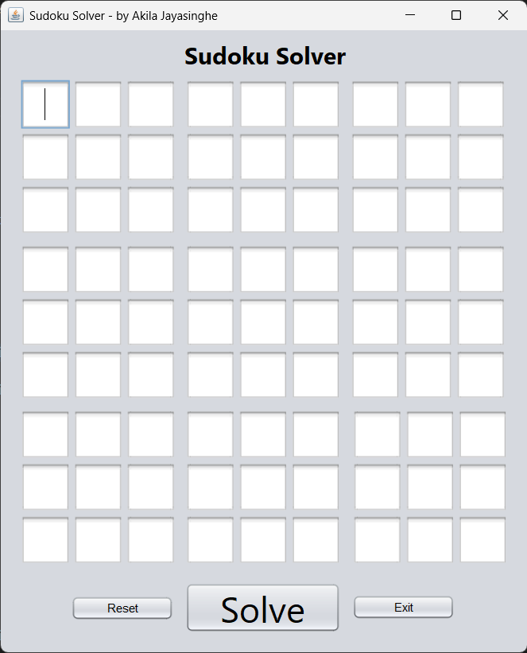
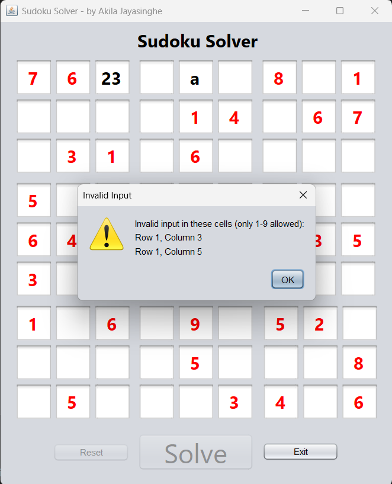
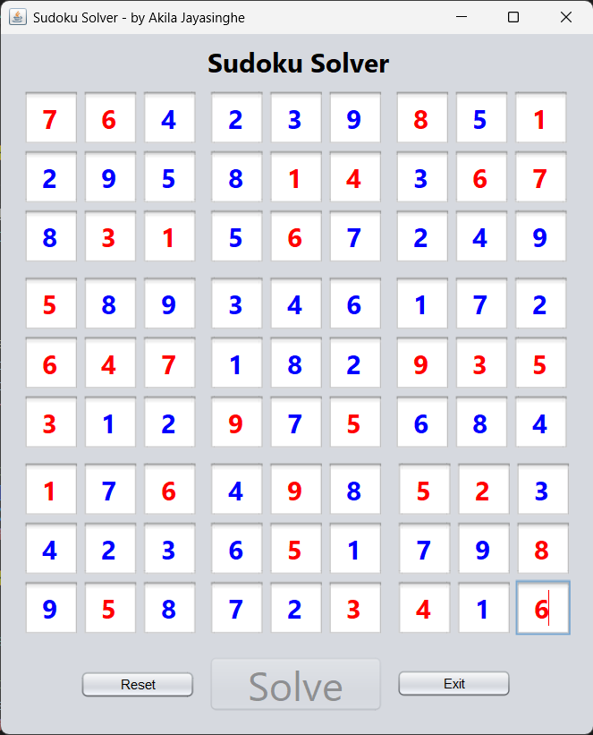

# 🧩 Sudoku Solver 

A Java-based Sudoku puzzle solver with intuitive GUI, supporting both manual input and automatic solving.

 &nbsp;&nbsp;&nbsp;&nbsp;&nbsp;  &nbsp;&nbsp;&nbsp;  &nbsp;&nbsp;&nbsp;  &nbsp;&nbsp;&nbsp;

## Tools
- User Interface was designed by using Java swing UI designer in Apache NetBeans

## 🚀 Features
- ✔️ Solves 9x9 Sudoku puzzles with 100% accuracy
- 🎨 Clean Swing GUI with Nimbus look-and-feel
- ⚡ Animated solving visualization (optional)
- 🔄 Reset functionality

## 📦 Installation
### Prerequisites
- Java 11 or later ([Download Java](https://www.java.com/download/))

### Running the Application
1. **Download the code**:
   code is still run with an IDE; JAR & EXE files will be uploaded soon
     - git clone https://github.com/yourusername/Sudoku-Solver.git
     - cd Sudoku-Solver
